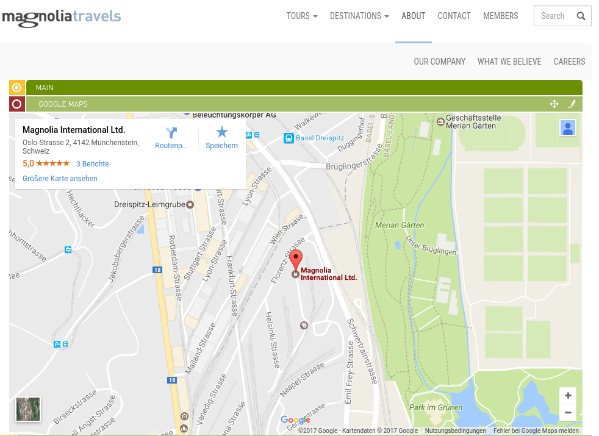
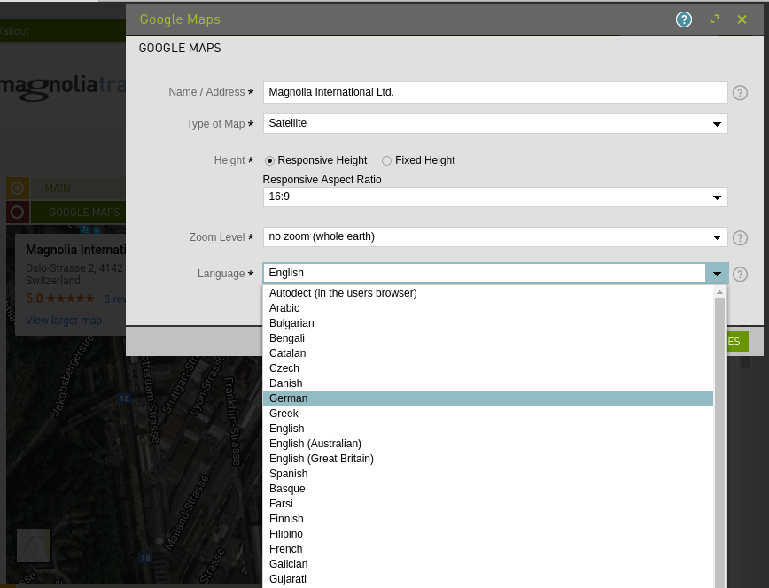

# google-maps-magnolia

Magnolia Light Module for providing a responsive google maps integration.

Screenshot Edit Mode       |  Screenshot Dialog
:-------------------------:|:-------------------------:
  |   


## Usage

1. install the light module using a package manager like npm or yarn

```sh
npm install google-maps-magnolia
```

2. Enable the `google-maps`-component in you desired areas like this:
```yaml
availableComponents:
    google-maps-magnolia:
        id: google-maps-magnolia:components/google-maps
```

**Hint**: If you're having the travel-demo (magnolia sample site), this component will automatically be available in the "Standard" Templates (see screenshots above).

3. (Optionally) customize your component by using your own templateScript. You can either do this by decorating the component or definining your own component, which then uses the `google-maps` dialog. The mentioned dialog may be decorated as well of course.

```yaml
dialog: google-maps-magnolia:components/google-maps
templateScript: /path/to/my/custom/template/script.ftl
```

**Hint**: You should try to stay *upgradeable* by including `utils.ftl` in your own templateScript and using the provided macros and functions. Afterwards a simple package update like `npm update google-maps-magnolia` will give you the latest bugfixes and enhancements for this light module. For the same reason you probably shouldn't write your own dialog, but decorate the existing one with your custom fields. Here is an example, how you could extend/wrap the `google-maps` component in a custom component:

```ftl
[#include "/google-maps-magnolia/templates/inc/utils.ftl" /]

<div class="my-custom-wrapper">
<h2>Google Maps Title</h2>
    [@renderGoogleMapsComponent content=content /]
</div>
```

## Information on Magnolia CMS
This directory is a Magnolia 'light module'. See https://docs.magnolia-cms.com for further details.


## License
The MIT License (MIT)

Copyright 2016 Matthias Müller <MattDiMu@users.noreply.github.com>

Permission is hereby granted, free of charge, to any person obtaining a copy of
this software and associated documentation files (the "Software"), to deal in
the Software without restriction, including without limitation the rights to
use, copy, modify, merge, publish, distribute, sublicense, and/or sell copies of
the Software, and to permit persons to whom the Software is furnished to do so,
subject to the following conditions:

The above copyright notice and this permission notice shall be included in all
copies or substantial portions of the Software.

THE SOFTWARE IS PROVIDED "AS IS", WITHOUT WARRANTY OF ANY KIND, EXPRESS OR
IMPLIED, INCLUDING BUT NOT LIMITED TO THE WARRANTIES OF MERCHANTABILITY, FITNESS
FOR A PARTICULAR PURPOSE AND NONINFRINGEMENT. IN NO EVENT SHALL THE AUTHORS OR
COPYRIGHT HOLDERS BE LIABLE FOR ANY CLAIM, DAMAGES OR OTHER LIABILITY, WHETHER
IN AN ACTION OF CONTRACT, TORT OR OTHERWISE, ARISING FROM, OUT OF OR IN
CONNECTION WITH THE SOFTWARE OR THE USE OR OTHER DEALINGS IN THE SOFTWARE.


## Contributors
[Matthias Müller](https://github.com/MattDiMu)


PS: Feel free to star this repo!